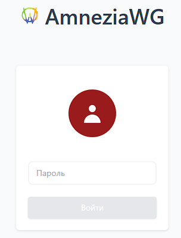
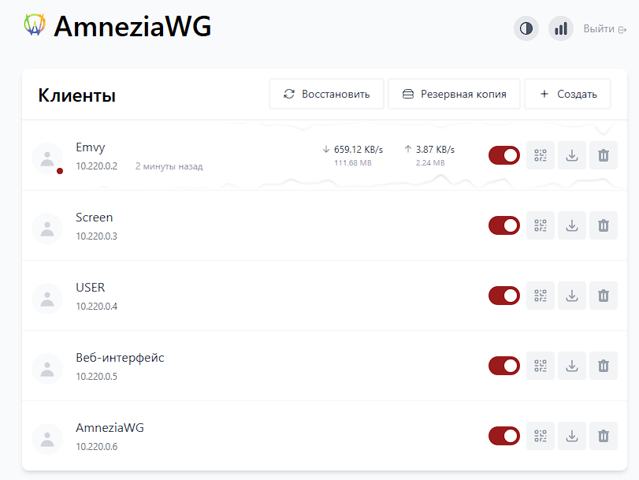

# AmneziaWG Easy

Вы нашли самый простой способ установки и управления AmneziaWG (обфусцированный Wireguard) на любом хосте Linux!

Основано на [`wg-easy v14`](https://github.com/wg-easy/wg-easy/tree/v14)

<p align="center">
  
  
</p>

## Функции
* Все в одном: AmneziaWG + веб-интерфейс.
* Простая установка, простое использование.
* Список, создание, редактирование, удаление, включение и отключение клиентов.
* QR-код клиента для подключения конфигурации.
* Загрузка (скачивания) файл конфигурации клиента (для отправки клиенту).
* Статистика по подключенным клиентам.
* Диаграммы Tx/Rx для каждого подключенного клиента.
* Поддержка Gravatar.
* Автоматический, светлый/темный режим темы.
* Поддержка большого количества языков.

## Требования

* Хост с ядром, поддерживающим WireGuard (на его основе создается конфиг для AmneziaWG) - все современные ядра.
* Хост с установленным Docker.
* Рекомендуется Ubuntu 24.04 (рабочая версия)

## Установка

### 1. Установите Докер

Если вы еще не установили Docker, установите его, выполнив:

```bash
curl -sSL https://get.docker.com | sh
sudo usermod -aG docker $(whoami)
exit
```
И войдите снова.

или 

```bash
sudo apt update
sudo apt install docker.io docker-compose
```

### 2. Запустите AmneziaWG Easy

AmneziaWG Easy рекомендуется запускать с помощью Docker Compose - загрузите фаил [`docker-compose.yml`](docker-compose.yml), внесите нужные Вам изменения (см. [Параметры](https://github.com/nonenulldev404/amneziawg-easy/blob/AmneziaWG/README.md#%D0%BF%D0%B0%D1%80%D0%B0%D0%BC%D0%B5%D1%82%D1%80%D1%8B)) и запустите `docker compose up -d //Необходимо запускать из каталога, где находится файл docker-compose.yml или указать путь к файлу docker-compose.yml`.

:exclamation: Обязательно:

Замените YOUR_ADMIN_PASSWORD_HASH на хэш пароля bcrypt для входа в веб-интерфейс. Смотрите [How_to_generate_an_bcrypt_hash.md](./How_to_generate_an_bcrypt_hash.md) для получения информации о том, как сгенерировать хэш.

Веб-интерфейс будет доступен на http://0.0.0.0:51821.


## Параметры

| Env (Переменные) | Значение по умолчанию | Пример изменения | Описание                                                                                                                                          |
| - | - | - |------------------------------------------------------------------------------------------------------------------------------------------------------|
| `PORT` | `51821` | `6789` | TCP-порт для веб-интерфейса.                                                                                                                                 |
| `WEBUI_HOST` | `0.0.0.0` | `localhost` | IP-адрес, к которому привязан веб-интерфейс.                                                                                                                          |
| `PASSWORD_HASH` | Отсутствует | `$2y$05$Ci...` | Если установлено, требуется пароль при входе в веб-интерфейс. Смотрите [How to generate an bcrypt hash.md](./How_to_generate_an_bcrypt_hash.md) для того, чтобы узнать, как сгенерировать хэш. |
| `WG_HOST` | - | `vpn.myserver.com или IP-адрес` | Публичное имя хоста или IP-адрес Вашего VPN-сервера.                                                                                                              |
| `WG_DEVICE` | `eth0` | `ens6f0` | Ethernet-устройство, через которое должен пересылаться трафик AmneziaWG (Wireguard).                                                                                   |
| `WG_PORT` | `51820` | `12345` | Публичный UDP порт Вашего VPN-сервера. AmneziaWG (Wireguard) будет прослушивать его (в противном случае — порт по умолчанию) внутри контейнера Docker.                                 |
| `WG_CONFIG_PORT`| `51820` | `12345` | Порт UDP, используемый в [Home Assistant Plugin](https://github.com/adriy-be/homeassistant-addons-jdeath/tree/main/wgeasy)                               
| `WG_MTU` | `null` | `1420` | MTU, который будут использовать клиенты. Сервер использует WG MTU по умолчанию.                                                                                            |
| `WG_PERSISTENT_KEEPALIVE` | `0` | `25` | Значение в секундах для поддержания "соединения" открытым. Если это значение равно 0, то соединения не будут поддерживаться.                                            |
| `WG_DEFAULT_ADDRESS` | `10.8.0.x` | `10.6.0.x` | Диапазон IP-адресов клиентов (Вашей сети VPN).                                                                                                                            |
| `WG_DEFAULT_DNS` | `1.1.1.1` | `8.8.8.8,8.8.4.4,9.9.9.9,1.1.1.1` | DNS-сервер, который клиенты будут использовать. Если задано пустое значение, клиенты не будут использовать DNS.                                                                    |
| `WG_ALLOWED_IPS` | `0.0.0.0/0, ::/0` | `192.168.15.0/24, 10.0.1.0/24` | Разрешенные IP-адреса, которые будут использовать клиенты.                                                                                                                        |
| `WG_PRE_UP` | `...` | - | Перед поднятием интерфейса - Подготовка (например, настройка firewall). Смотрите [config.js](https://github.com/nonenulldev404/amneziawg-easy/blob/AmneziaWG/src/config.js) для значения по умолчанию.                                             |
| `WG_POST_UP` | `...` | `iptables ...` | После поднятия интерфейса - Роутинг, NAT, правила iptables и т.п. Смотрите [config.js](https://github.com/nonenulldev404/amneziawg-easy/blob/AmneziaWG/src/config.js) для значения по умолчанию.                               |
| `WG_PRE_DOWN` | `...` | - | Перед остановкой интерфейса - Очистка или подготовка к отключению. Смотрите [config.js](https://github.com/nonenulldev404/amneziawg-easy/blob/AmneziaWG/src/config.js) для значения по умолчанию.                                             |
| `WG_POST_DOWN` | `...` | `iptables ...` | 	После остановки интерфейса - Финальная очистка. Смотрите [config.js](https://github.com/nonenulldev404/amneziawg-easy/blob/AmneziaWG/src/config.js) для значения по умолчанию.                                        |
| `LANG` | `en` | `ru` | Язык веб-интерфейса (поддерживается: en, ua, ru, tr, no, pl, fr, de, ca, es, ko, vi, nl, is, pt, chs, cht, it, th, hi).                                        |
| `UI_TRAFFIC_STATS` | `false` | `true` | Включить подробную статистику RX/TX (приём/передача данных) клиента в веб-интерфейсе. RX (Receive) — сколько данных клиент получил (за всё время и за секнду), TX (Transmit) — сколько клиент данных отправил (за всё время и за секнду). Измеряется в байтах (Всего получено или отправлено байт B(bytes), KB, MB, GB, а так же получено или отправлено байт за секнду B(bytes)/s, KB/s, MB/s, GB/s).                                                                                                      |
| `UI_CHART_TYPE` | `0` | `1` | UI_CHART_TYPE=0 # Диаграммы отключены, UI_CHART_TYPE=1 # Линейная диаграмма, UI_CHART_TYPE=2 # Диаграмма с областями, UI_CHART_TYPE=3 # Столбчатая диаграмма.                           |
| `AMNEZIA_JC` | `random` | `1...128` | Один из параметров обфускации стандартной WireGuard конфигурации. По умолчанию выставляется рандомно для каждого клиента в диапазоне от 1 до 128 (условие обфускации Amnezia). Можно выставить значене вручную, но только в диапазоне от 1 до 128 (данное значение будет применяться к каждому клиенту).                          |
| `AMNEZIA_JMAX` | `random` | `1...1280` | Один из параметров обфускации стандартной WireGuard конфигурации. По умолчанию выставляется рандомно для каждого клиента в диапазоне от 1 до 1280 (условие обфускации Amnezia). Можно выставить значене вручную, но только в диапазоне от 1 до 1280 (данное значение будет применяться к каждому клиенту).                          |
| `AMNEZIA_JMIN` | `random` | `любое значение, но значение AMNEZIA_JMIN не должно превышать AMNEZIA_JMAX` | Один из параметров обфускации стандартной WireGuard конфигурации. По умолчанию выставляется рандомно для каждого клиента в диапазоне не превышающем AMNEZIA_JMAX (условие обфускации Amnezia). Можно выставить значене вручную, но только в диапазоне не превышающем AMNEZIA_JMAX (данное значение будет применяться к каждому клиенту).                          |

> Если вы меняете WG_PORT, не забудьте также изменить открытый порт PORT.

> Оставшиеся параметры обфускации - S1, S2, H1, H2, H3, H4 - заданы жестко и неизменяемы. Имеют значение: S1= 0, S2 = 0, H1 = 1, H2 = 2, H3 = 3, H4 = 4 - условие обфускации Amnezia. Если изменить данные параметры, ничего работать не будет.

## Обновление

Чтобы обновиться до последней версии, просто запустите:

```bash
docker-compose down //Необходимо запускать из каталога, где находится файл docker-compose.yml или указать путь к файлу docker-compose.yml
docker compose up -d //Необходимо запускать из каталога, где находится файл docker-compose.yml или указать путь к файлу docker-compose.yml
```
